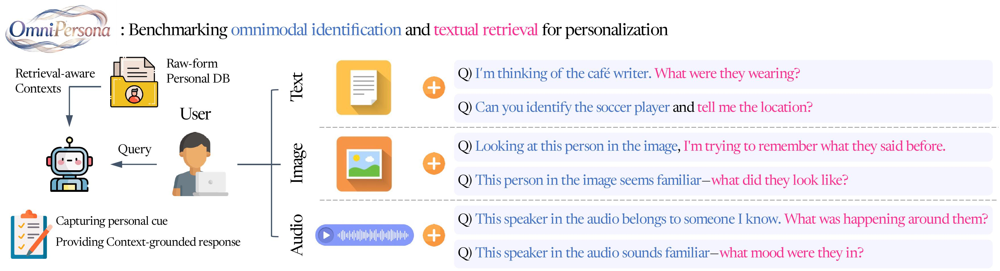
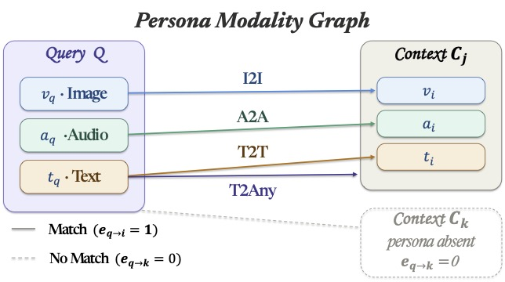
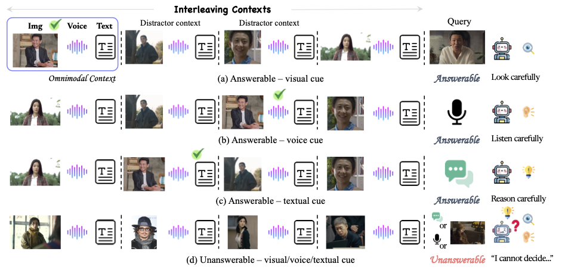

# Omni-Persona

[](https://arxiv.org/abs/2605.09996) [](https://huggingface.co/datasets/Yeongtak/Omni-Persona-Benchmark)

**Systematic benchmarking of omnimodal personalization — grounding *and* calibrated abstention.**

Omni-Persona asks a model to do the thing a personal assistant actually has to do: given
interleaved **image + audio + text** memories about four different people, figure out *which*
person a query refers to, answer from **that** person's memory — and say "I cannot determine
that" when the memory does not contain the answer.

This repository contains the **evaluation code** for the v2.2 benchmark — everything needed to
reproduce the paper's main table — and the **RLVR training** data and recipe.

- **750 items** · 391 answerable / 359 unanswerable · 4 task groups · 18 fine-grained tasks
- Metrics: guarded **Ans**, count-weighted **Cal**, **1-FA**, **TA**
- Dataset: [`Yeongtak/Omni-Persona-Benchmark`](https://huggingface.co/datasets/Yeongtak/Omni-Persona-Benchmark)
  — benchmark annotations and assets under `assets/`, RLVR training assets under `training_assets/`
- Models: [3B RLVR](https://huggingface.co/Yeongtak/Qwen2.5-Omni-3B-Omni-Persona-RLVR) ·
  [7B RLVR](https://huggingface.co/Yeongtak/Qwen2.5-Omni-7B-Omni-Persona-RLVR)

> **What is here.** The full evaluation path — inference, judging and scoring — plus the released
> RLVR checkpoints, so every number in the main table can be reproduced today. Also
> [`training/`](./training): the RLVR training data and a Qwen2.5-Omni skeleton covering the
> reward functions, the task mixture, and the GSPO configuration behind those checkpoints.
>
---

<p align="center">
  
</p>

<p align="center"><em>A query arrives in text / image / audio; the model must identify the target
persona from pre-retrieved omnimodal contexts and answer grounded in that persona's memory.</em></p>

## Why this benchmark

Most personalization benchmarks reward a model for answering. Omni-Persona rewards it for
answering **when it should** and declining **when it should not**, because roughly half of the
items are unanswerable by construction — either the queried person is absent from the memory
entirely (150 items), or the person is present but the asked attribute is simply not stated
(209 items).

<p align="center">
  
</p>

Personalization is formalized as **cross-modal routing over a Persona Modality Graph (PMG)**:
each persona is a node `(image, audio, text)`, and a query must form an edge to the right node
or abstain. Query modality × target modality gives four groups:

| Group | Query is… | Routing path | Items |
|---|---|---|---:|
| **I2I** | a face photo | image → identity → attribute | 231 |
| **A2A** | a voice clip | audio → identity → attribute | 247 |
| **T2T** | a textual description | text → identity → attribute | 124 |
| **T2Any** | a description of what someone *said* | text → audio content → identity → attribute | 148 |

<p align="center">
  
</p>

<p align="center"><em>Each item pairs a query with four candidate personas and hard distractors;
unanswerable items omit the target persona or the asked attribute.</em></p>

Full task taxonomy, field schema and construction details: [`docs/DATASET_CARD.md`](docs/DATASET_CARD.md).

## Main table

Guarded metrics on the full 750 items (×100). An answerable item counts as correct only if the
model **does not abstain** *and* the judge returns `CORRECT`; an unanswerable item counts as
correct only if the model abstains.

| Model | Ans ↑ | Cal ↑ | 1-FA ↑ | TA ↑ |
|---|---:|---:|---:|---:|
| Qwen2.5-Omni-3B (base) | 34.0 | 36.7 | 74.9 | 39.6 |
| Qwen2.5-Omni-3B + RLVR | 40.9 | 34.1 | 84.7 | 26.7 |
| Qwen2.5-Omni-7B (base) | 38.6 | 30.9 | 82.1 | 22.6 |
| Qwen2.5-Omni-7B + RLVR | 47.8 | 28.4 | 98.0 | 7.2 |

`Ans` = accuracy on the 391 answerable items · `Cal` = count-weighted calibrated accuracy over
all 750 · `1-FA` = attempt rate on answerable items · `TA` = true-abstention rate on the 359
unanswerable items.

Read the columns **together**. RLVR buys a large gain in `Ans` and `1-FA` by nearly abandoning
abstention — the 7B checkpoint attempts 98.0% of answerable items and correctly abstains on only
7.2% of unanswerable ones, so `Cal` *drops*. Surfacing that trade-off is the point of the
benchmark.

---

## Quickstart

### 1. Install

```bash
git clone https://github.com/oyt9306/Omni-Persona.git
cd Omni-Persona
pip install -r requirements.txt          # client only: requests, tqdm
```

The vLLM server that hosts the model under test lives in a **separate** environment — do not
install vLLM into the client env. See `scripts/serve_model.sh`.

You also need an **OpenAI-compatible judge endpoint** serving `gpt-5.4-mini`
(default `http://localhost:8091/v1`). Metrics are defined against that judge; swapping it
changes `Ans`/`Cal`.

### 2. Get the data

```bash
hf download Yeongtak/Omni-Persona-Benchmark \
    --repo-type dataset --local-dir omni-persona-data
```

~1.2 GB: `omni_persona_v2_2.jsonl` plus `assets/lsd/sample_<id>/{concept_0..3,query}.{png,wav}`.
Point the runner at it:

```bash
export BENCH=omni-persona-data/omni_persona_v2_2.jsonl
export ASSET_ROOT=omni-persona-data/assets/lsd
```

### 3. Full run

```bash
scripts/run_eval.sh <MODEL_PATH_OR_HF_ID> <RUN_NAME>
# e.g.
scripts/run_eval.sh Qwen/Qwen2.5-Omni-7B qwen7b-base
```

One command serves the model, runs inference, judges, scores, and tears the server down again.
Useful env vars: `BENCH`, `ASSET_ROOT`, `GPU`, `PORT`, `OUT_ROOT`, `JUDGE_BASE_URL`,
`JUDGE_MODEL`, `NUM_WORKERS`, `JUDGE_WORKERS`, `PYTHON`, `VLLM_BIN`.

### 4. Read the output

`scripts/run_eval.sh` prints the main-table row directly:

```
Omni-Persona v2.2 — guarded metrics   model: qwen7b-base
  N=750  answerable=391  unanswerable=359

  Main table row
  ----------------------------------------------
      Ans    Cal   1-FA     TA    Avg
     38.6   30.9   82.1   22.6   52.4

  Per scenario
  ----------------------------------------------
  group      N     Ans   Unans     Cal
  I2I      231     ...     ...     ...
  ...
```

Artifacts land in `results/<RUN_NAME>/`: `predictions.jsonl`, `judge_results.jsonl`,
`scores.json`, `scores.csv`, and the `serve` / `infer` / `judge` / `score` logs.

**Tolerance.** `1-FA` and `TA` come from a frozen keyword rule and should match near-exactly.
`Ans` and `Cal` inherit judge sampling noise of up to ~1 point — treat a ≤1.0-point deviation
from the table above as a successful reproduction.

---

## Layout

```
omni_persona/
  data.py     load the benchmark, build the multimodal message list (frozen prompt format)
  infer.py    query an OpenAI-compatible endpoint (temperature=0.0, max_tokens=256)
  judge.py    LLM-as-a-judge + the frozen keyword abstention detector
  score.py    guarded metrics -> main-table row
scripts/
  serve_model.sh   vLLM serve for Qwen2.5-Omni (+ --stop teardown)
  run_eval.sh      one full cycle: serve -> infer -> judge -> score
  smoke_test.sh    tiny stratified subset, fast
tools/
  export_dataset.py  rebuild the release JSONL from the internal annotation file
  upload_hf.sh       publish dataset + checkpoints to the Hub (dry-run by default)
docs/
  DATASET_CARD.md      HF dataset card: taxonomy, schema, protocol, limitations
  MODEL_CARD.md        HF model card for the two RLVR checkpoints
figures/
  figure1.jpg PMG.jpg omnimodal_context.png   README illustrations
```

## Released checkpoints

| Checkpoint | Base | Size |
|---|---|---:|
| `Qwen2.5-Omni-3B-Omni-Persona-RLVR` | `Qwen/Qwen2.5-Omni-3B` | 12 GB |
| `Qwen2.5-Omni-7B-Omni-Persona-RLVR` | `Qwen/Qwen2.5-Omni-7B` | 21 GB |

## Citation

```bibtex
@article{oh2026omni,
  title   = {Omni-Persona: Systematic Benchmarking and Improving Omnimodal Personalization},
  author  = {Oh, Yeongtak and Lee, Dongwook and Park, Sangkwon and Kim, Heeseung and Yoon, Sungroh},
  journal = {arXiv preprint arXiv:2605.09996},
  year    = {2026}
}
```
